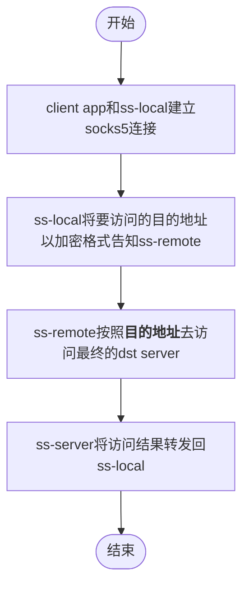
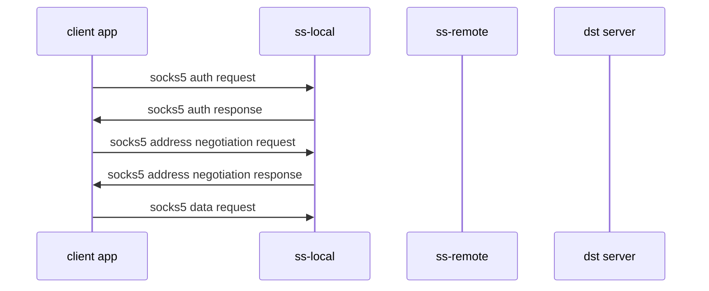
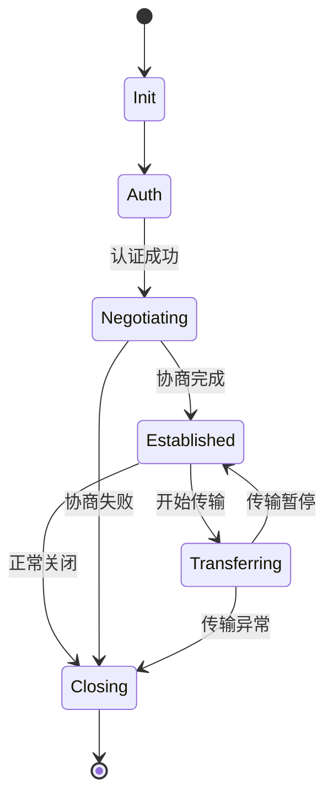

# ShadowSocks协议

# 流程

```mermaid
flowchart TD
    Start([开始]) --> A
    A[client app和ss-local建立socks5连接] --> B
    B[ss-local将要访问的目的地址以加密格式告知ss-remote] --> C
    C[ss-remote按照<b>目的地址</b>去访问最终的dst server] --> D
    D[ss-server将访问结果转发回ss-local] --> E([结束])
```

# 时序图

```mermaid
sequenceDiagram
    participant C as client app
    participant L as ss-local
    participant R as ss-remote
    participant S as dst server
    C->>L: socks5 auth request
    L->>C: socks5 auth response
    C->>L: socks5 address negotiation request
    L->>C: socks5 address negotiation response
    C->>L: socks5 data request
```

# TcpHandler状态转移图

```mermaid
stateDiagram-v2
    [*] --> Init
    Init --> Auth
    Auth --> Negotiating: 认证成功
    Negotiating --> Established: 协商完成
    Established --> Transferring: 开始传输
    Transferring --> Established: 传输暂停
    Established --> Closing: 正常关闭
    Negotiating --> Closing: 协商失败
    Transferring --> Closing: 传输异常
    Closing --> [*]

```